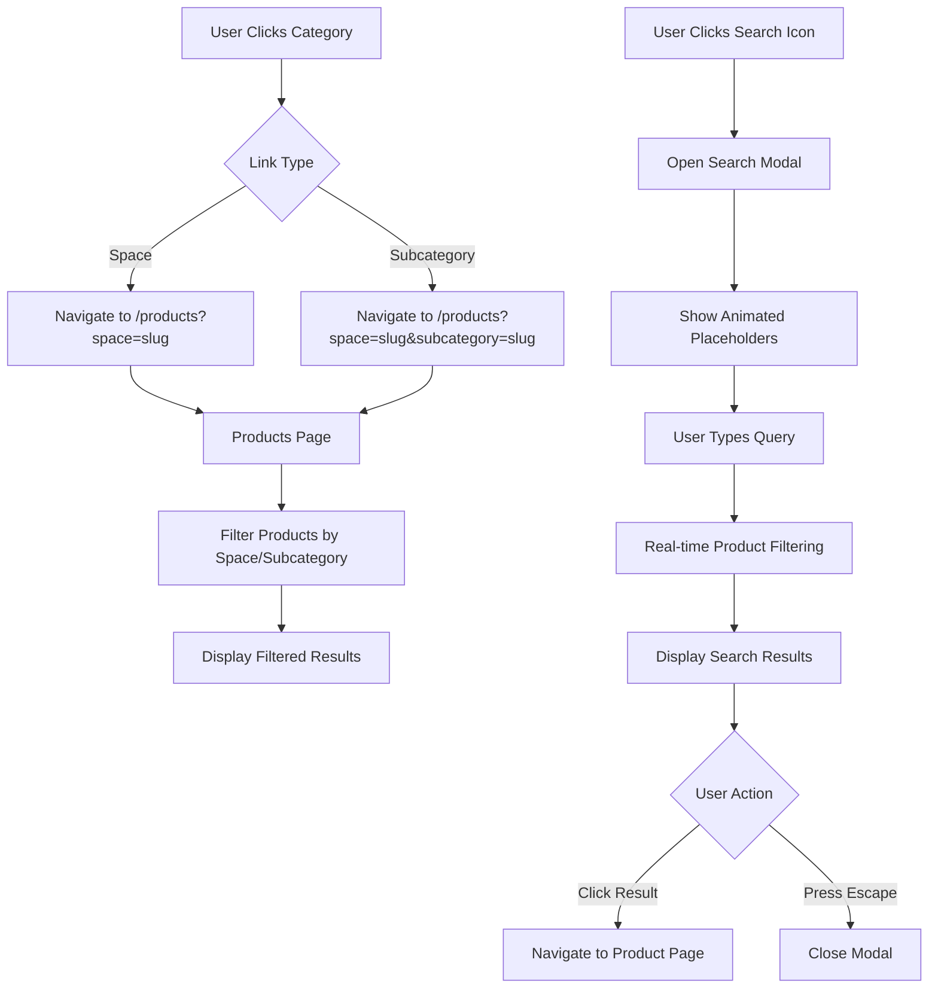

# Design Document

## Overview

This design addresses two critical user experience issues in the Authentic Furniture e-commerce platform:

1. **Navigation Link Corrections**: Fix the routing mismatch between the Popular Categories grid and the products page filtering system
2. **Enhanced Search Modal**: Create an impressive, animated search experience with real-time product filtering

The solution ensures users can successfully navigate to product listings and find products through an intuitive search interface.

## Architecture

### Component Structure

```
components/
├── home/
│   └── Categories.tsx (UPDATE - fix category links)
├── layout/
│   ├── Header.tsx (UPDATE - fix dropdown links, add search modal)
│   └── CrazyNavbar.tsx (UPDATE - fix dropdown links, add search modal)
└── ui/
    └── SearchModal.tsx (NEW - animated search interface)
```

### Data Flow



## Components and Interfaces

### 1. Categories Component Updates

**File**: `components/home/Categories.tsx`

**Changes Required**:
- Update `popularCategories` array to include proper space/subcategory mapping
- Change link generation from `/products?category=` to `/products?subcategory=`
- Add space context where needed

**Data Structure**:
```typescript
interface PopularCategory {
  name: string;
  slug: string; // subcategory slug
  spaceSlug?: string; // optional space slug for proper filtering
  image: string;
  productCount: number;
}
```

**Link Generation Logic**:
```typescript
// OLD (incorrect):
href={`/products?category=${category.slug}`}

// NEW (correct):
href={`/products?subcategory=${category.slug}`}
// OR with space context:
href={`/products?space=${category.spaceSlug}&subcategory=${category.slug}`}
```

### 2. Header/Navbar Component Updates

**Files**: 
- `components/layout/Header.tsx`
- `components/layout/CrazyNavbar.tsx`

**Changes Required**:
- Verify "Shop by Space" dropdown links use correct URL format
- Replace basic search Popover with SearchModal trigger
- Add SearchModal component integration

**Current Link Format** (already correct in Header.tsx):
```typescript
// Space link:
href={`/products?space=${space.slug}`}

// Subcategory link:
href={`/products?space=${space.slug}&subcategory=${subcategory.slug}`}
```

**Search Integration**:
```typescript
// Replace Popover with Modal trigger
<Button onClick={() => setIsSearchModalOpen(true)}>
  <Search className="h-5 w-5" />
</Button>

<SearchModal 
  isOpen={isSearchModalOpen} 
  onClose={() => setIsSearchModalOpen(false)} 
/>
```

### 3. SearchModal Component (NEW)

**File**: `components/ui/SearchModal.tsx`

**Component Interface**:
```typescript
interface SearchModalProps {
  isOpen: boolean;
  onClose: () => void;
}

interface SearchResult {
  id: string;
  name: string;
  slug: string;
  category: string;
  price: number;
  imageUrl: string;
  inStock: boolean;
}
```

**Key Features**:
1. **Full-screen overlay** with backdrop blur
2. **Animated entrance/exit** using Framer Motion
3. **Rotating placeholder text** showcasing product categories
4. **Real-time search** with debouncing (300ms)
5. **Product result cards** with images and prices
6. **Keyboard navigation** (Escape to close, Arrow keys for results)
7. **Mobile-responsive** layout
8. **Empty state** with popular categories/products

**Animation Specifications**:
```typescript
// Modal entrance
const modalVariants = {
  hidden: { opacity: 0, scale: 0.95 },
  visible: { 
    opacity: 1, 
    scale: 1,
    transition: { duration: 0.2, ease: "easeOut" }
  },
  exit: { 
    opacity: 0, 
    scale: 0.95,
    transition: { duration: 0.15, ease: "easeIn" }
  }
};

// Placeholder rotation
const placeholders = [
  "office tables",
  "conference tables", 
  "student desks",
  "outdoor seating for bars",
  "executive chairs",
  "sofa sets",
  "storage cabinets"
];

// Rotate every 2 seconds
useEffect(() => {
  const interval = setInterval(() => {
    setCurrentPlaceholder(prev => (prev + 1) % placeholders.length);
  }, 2000);
  return () => clearInterval(interval);
}, []);
```

**Search Logic**:
```typescript
const [searchQuery, setSearchQuery] = useState("");
const [searchResults, setSearchResults] = useState<SearchResult[]>([]);
const [isSearching, setIsSearching] = useState(false);

// Debounced search
useEffect(() => {
  const timer = setTimeout(async () => {
    if (searchQuery.trim().length >= 2) {
      setIsSearching(true);
      const results = await searchProducts(searchQuery);
      setSearchResults(results);
      setIsSearching(false);
    } else {
      setSearchResults([]);
    }
  }, 300);

  return () => clearTimeout(timer);
}, [searchQuery]);
```

**Layout Structure**:
```tsx
<AnimatePresence>
  {isOpen && (
    <motion.div className="fixed inset-0 z-50">
      {/* Backdrop */}
      <motion.div 
        className="absolute inset-0 bg-black/60 backdrop-blur-sm"
        onClick={onClose}
      />
      
      {/* Modal Content */}
      <motion.div className="relative h-full flex items-start justify-center pt-20">
        <div className="w-full max-w-3xl px-4">
          {/* Search Input */}
          <div className="bg-white rounded-2xl shadow-2xl p-6">
            <input
              type="text"
              placeholder={placeholders[currentPlaceholder]}
              className="w-full text-2xl border-none focus:outline-none"
              value={searchQuery}
              onChange={(e) => setSearchQuery(e.target.value)}
              autoFocus
            />
          </div>
          
          {/* Results */}
          <div className="mt-4 bg-white rounded-2xl shadow-2xl max-h-[60vh] overflow-y-auto">
            {isSearching && <LoadingSpinner />}
            {searchResults.length > 0 && (
              <SearchResults results={searchResults} onClose={onClose} />
            )}
            {searchQuery.length >= 2 && searchResults.length === 0 && !isSearching && (
              <EmptyState query={searchQuery} />
            )}
            {searchQuery.length < 2 && (
              <PopularProducts />
            )}
          </div>
        </div>
      </motion.div>
    </motion.div>
  )}
</AnimatePresence>
```

### 4. Search Function (lib/products.ts)

**New Function**:
```typescript
export async function searchProducts(query: string): Promise<Product[]> {
  const searchTerm = query.toLowerCase().trim();
  
  if (!isSupabaseConfigured()) {
    return fallbackProducts.filter(product =>
      product.name.toLowerCase().includes(searchTerm) ||
      product.category.toLowerCase().includes(searchTerm) ||
      product.description.toLowerCase().includes(searchTerm) ||
      product.features.some(f => f.toLowerCase().includes(searchTerm))
    ).slice(0, 10);
  }

  try {
    const { data, error } = await supabase
      .from('products')
      .select(`
        *,
        space:spaces(*),
        subcategory:subcategories(*)
      `)
      .or(`name.ilike.%${searchTerm}%,category.ilike.%${searchTerm}%,description.ilike.%${searchTerm}%`)
      .eq('in_stock', true)
      .limit(10);

    if (error) throw error;
    
    return data ? data.map(mapSupabaseRowToProduct) : [];
  } catch (error) {
    console.error('Search error:', error);
    return fallbackProducts.filter(product =>
      product.name.toLowerCase().includes(searchTerm) ||
      product.category.toLowerCase().includes(searchTerm) ||
      product.description.toLowerCase().includes(searchTerm)
    ).slice(0, 10);
  }
}
```

## Data Models

### URL Parameter Structure

**Space Filtering**:
```
/products?space=office
```

**Subcategory Filtering**:
```
/products?subcategory=office-tables
```

**Combined Filtering** (recommended):
```
/products?space=office&subcategory=office-tables
```

### Product Filtering Logic (app/products/page.tsx)

The existing filtering logic already handles space and subcategory parameters correctly:

```typescript
// Filter by Space
if (urlSpace) {
  filtered = filtered.filter(product => {
    const productSpaceSlug = (product.space?.slug || "").toLowerCase();
    return productSpaceSlug === urlSpace.toLowerCase();
  });
}

// Filter by Subcategory
if (urlSubcategory) {
  filtered = filtered.filter(product => {
    const productSubSlug = (product.subcategory?.slug || "").toLowerCase();
    const productCategory = product.category.toLowerCase();
    const subcategoryName = urlSubcategory.replace(/-/g, ' ').toLowerCase();
    
    return productSubSlug === urlSubcategory.toLowerCase() || 
           productCategory.includes(subcategoryName) ||
           subcategoryName.includes(productCategory);
  });
}
```

## Error Handling

### Navigation Errors

1. **No Products Found**:
   - Display friendly message: "No products found in this category"
   - Show suggestions: "Browse all products" or "View related categories"
   - Log issue for debugging

2. **Invalid Space/Subcategory**:
   - Redirect to all products page
   - Show notification: "Category not found"

### Search Errors

1. **API Failure**:
   - Fall back to client-side filtering
   - Show cached/popular products
   - Display subtle error indicator

2. **No Results**:
   - Show "No results found for '{query}'"
   - Suggest alternative searches
   - Display popular categories

3. **Network Issues**:
   - Show loading state
   - Timeout after 5 seconds
   - Fall back to cached data

## Testing Strategy

### Navigation Testing

1. **Unit Tests**:
   - Test link generation with various space/subcategory combinations
   - Verify URL parameter parsing
   - Test filtering logic with different parameter combinations

2. **Integration Tests**:
   - Click through all navigation links
   - Verify correct products display for each category
   - Test breadcrumb navigation

3. **Manual Testing Checklist**:
   - [ ] Click each Popular Category card
   - [ ] Click each "Shop by Space" dropdown item
   - [ ] Click each subcategory in dropdown
   - [ ] Verify products display correctly
   - [ ] Test on mobile and desktop

### Search Testing

1. **Unit Tests**:
   - Test search function with various queries
   - Test debouncing logic
   - Test result filtering and sorting

2. **Integration Tests**:
   - Test modal open/close
   - Test keyboard navigation
   - Test result click navigation
   - Test empty state display

3. **Performance Tests**:
   - Measure search response time
   - Test with large result sets
   - Verify smooth animations on low-end devices

4. **Manual Testing Checklist**:
   - [ ] Open search modal
   - [ ] Verify placeholder animations
   - [ ] Type search query
   - [ ] Verify real-time results
   - [ ] Click search result
   - [ ] Test Escape key
   - [ ] Test on mobile
   - [ ] Test with keyboard navigation

## Mobile Responsiveness

### Search Modal Mobile Adaptations

1. **Layout**:
   - Full viewport height
   - Reduced padding (p-4 instead of p-6)
   - Smaller text sizes (text-xl instead of text-2xl)
   - Single column result grid

2. **Keyboard Handling**:
   - Auto-focus input on open
   - Prevent body scroll when modal open
   - Adjust viewport when keyboard appears

3. **Touch Interactions**:
   - Larger tap targets (min 44x44px)
   - Swipe down to close
   - Smooth scroll in results

### Navigation Mobile Considerations

1. **Popular Categories**:
   - Horizontal scroll maintained
   - Touch-friendly card sizes
   - Smooth scroll behavior

2. **Dropdown Menu**:
   - Already uses Sheet component (drawer)
   - Accordion for space/subcategory hierarchy
   - Full-width touch targets

## Performance Considerations

1. **Search Debouncing**: 300ms delay prevents excessive API calls
2. **Result Limiting**: Maximum 10 results for fast rendering
3. **Image Optimization**: Lazy load result images
4. **Animation Performance**: Use GPU-accelerated transforms
5. **Code Splitting**: Lazy load SearchModal component

## Accessibility

1. **Keyboard Navigation**:
   - Tab through search results
   - Arrow keys for result selection
   - Escape to close modal
   - Enter to select result

2. **Screen Readers**:
   - Proper ARIA labels
   - Announce search results count
   - Announce loading states

3. **Focus Management**:
   - Auto-focus search input on open
   - Return focus to trigger on close
   - Trap focus within modal

## Dependencies

- **Existing**: framer-motion (already in project)
- **Existing**: lucide-react (for icons)
- **Existing**: Next.js routing
- **Existing**: Supabase client
- **No new dependencies required**
